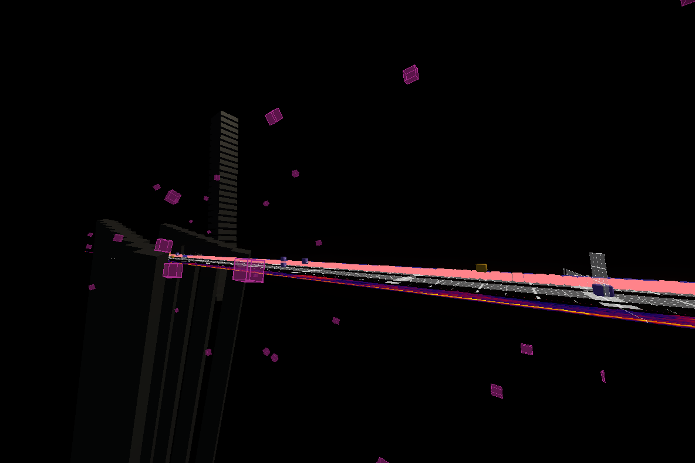
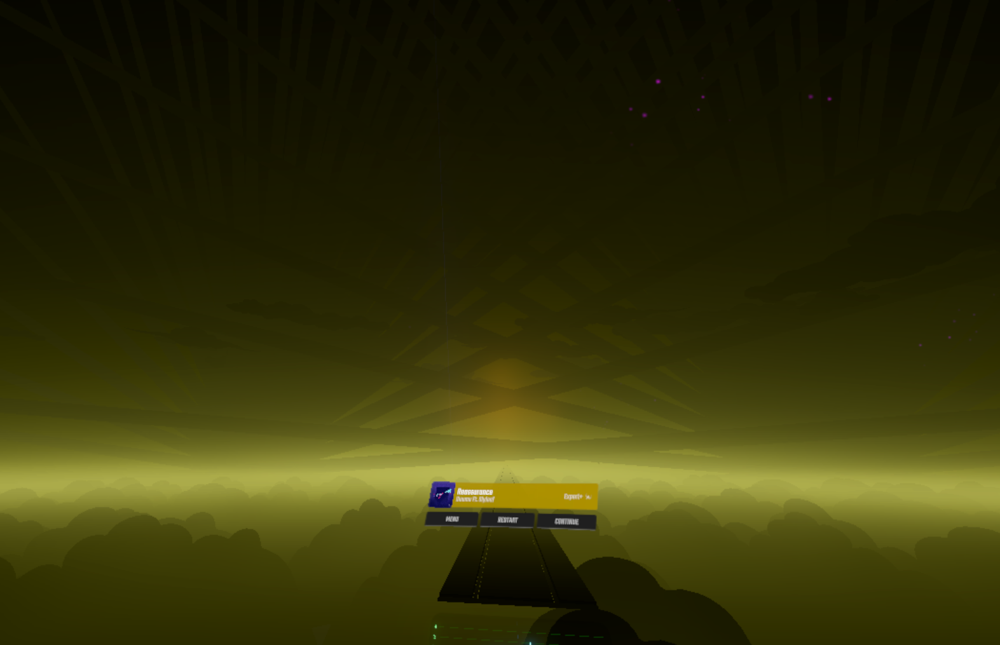

# Before you start
 It is important to know javascript and to read the [Noodle Extension documentation](https://www.google.com/search?client=firefox-b-d&q=ducomentation).

### Useful tools:
1. [Visual Studio Code](https://code.visualstudio.com/Download)

2. [Chrommaper](https://github.com/Caeden117/ChroMapper)

3. [Beat Saber](https://beatsaber.com/)

# How to use it
1.Download [Script.js](./Script.js) to your map folder

2.Change the INPUT and OUTPUT difficulties

3.Start coding

4.Run the script through Node.js

# Example(s)

  
  

